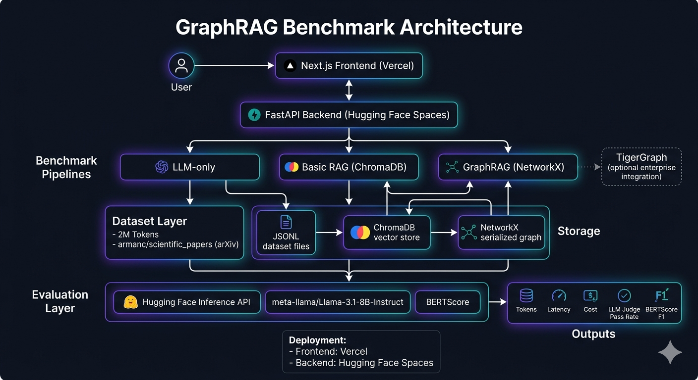

# GraphRAG Benchmark

GraphRAG Benchmark is a reproducible benchmark harness that compares three answer-generation pipelines on the same scientific-paper corpus:

- **LLM-only**: answers directly from the model without retrieved context.
- **Basic RAG**: retrieves chunks from ChromaDB using vector similarity.
- **GraphRAG**: retrieves graph-connected chunks using NetworkX-based entity traversal and multi-hop graph context.

The project measures both efficiency and answer quality:

- Tokens
- Latency
- Estimated cost
- LLM-as-a-Judge pass rate
- BERTScore F1

The dashboard shows all three pipelines side-by-side and highlights winners for accuracy, token usage, speed, and overall score.

## Architecture



```text
Frontend dashboard (Next.js)
  -> Backend API (FastAPI)
  -> LLM-only pipeline
  -> Basic RAG pipeline with ChromaDB
  -> GraphRAG pipeline with NetworkX
  -> Optional TigerGraph connector, disabled by default
```

## Why NetworkX is the Primary GraphRAG Engine

The goal of this project is methodological benchmarking: prove whether graph-structured retrieval and multi-hop reasoning improve efficiency and answer quality compared with LLM-only and Basic RAG.

GraphRAG is defined here by the retrieval method, not by dependence on a specific graph database vendor. NetworkX provides the graph traversal and reasoning capabilities needed for benchmarking while staying lightweight, deterministic, and reproducible on any laptop.

TigerGraph remains supported as an optional enterprise connector for large-scale production use, but it is not required for local development, ingestion, benchmarking, evaluation, dashboard functionality, or judging. TigerGraph setup introduces operational complexity such as authentication, Docker resource requirements, and infrastructure overhead. Those concerns are useful for enterprise deployment discussions, but they distract from the benchmark objective.

To keep judging easy and reproducible, NetworkX is the default implementation.

| Capability | NetworkX | TigerGraph |
|----------|----------|----------|
| Multi-hop graph traversal | Yes | Yes |
| GraphRAG benchmarking | Yes | Yes |
| Runs on any laptop | Yes | No |
| Zero setup overhead | Yes | No |
| Infrastructure complexity | Low | High |
| Required for benchmark | Yes | No |
| Enterprise scalability | Limited | Excellent |

**The benchmark conclusions are based on retrieval methodology, not on dependence on a specific graph database.**

## Why Hybrid GraphRAG?

Pure graph traversal can drift when the first matched node is too broad or unrelated to the user's intent. Hybrid GraphRAG fixes that by grounding retrieval semantically first, then using the graph for relationship-aware expansion.

```text
Query
  -> ChromaDB seed retrieval
  -> NetworkX graph expansion
  -> Semantic reranking
  -> Token-budgeted context
  -> LLM answer
```

**Basic RAG** is vector retrieval only: it finds semantically similar chunks and sends them to the model.

**Hybrid GraphRAG** is vector retrieval plus graph traversal plus reranking: ChromaDB selects high-similarity seed chunks, NetworkX expands to related entities and neighboring chunks, semantic reranking removes noisy graph neighbors, and token budgeting keeps the prompt compact.

This reflects real-world GraphRAG systems: vector search provides semantic grounding, graph traversal adds multi-hop evidence, and reranking prevents irrelevant graph context from entering the prompt.

### Hybrid GraphRAG Implementation Notes

The production GraphRAG path is implemented in:

```text
pipelines/graphrag/hybrid_retriever.py
pipelines/graphrag/graph_utils.py
pipelines/graphrag/reranker.py
pipelines/shared/token_utils.py
```

The public pipeline entrypoint remains:

```text
pipelines/graphrag/graphrag_pipeline.py::run_graphrag
```

API response compatibility is preserved. Existing fields such as `answer`, `context`, `tokens`, `latency`, and `details.chunks` are still returned. Hybrid-specific metadata is added under `retrieval_trace`:

```json
{
  "mode": "hybrid_graphrag",
  "seed_count": 8,
  "expanded_node_count": 40,
  "expanded_edge_count": 12,
  "reranked_candidate_count": 48,
  "fallback_used": false,
  "graph_hops": 1
}
```

Fallback is not treated as a failure. If graph expansion is empty, noisy, or unavailable, GraphRAG safely falls back to the semantic seed chunks while still reporting `mode = "hybrid_graphrag"` and `fallback_used = true`.

### Hybrid GraphRAG Regression Query

Use this query to verify that GraphRAG is grounded by semantic seeds before graph traversal:

```text
How do variable stars help determine distance and star formation history in nearby dwarf galaxies?
```

Expected GraphRAG context should mention:

- variable stars
- nearby dwarf galaxies
- distance determinations
- star formation history
- tracers of star formation

It should not retrieve unrelated Jacobi-equation context.

Quick smoke test:

```powershell
python -c "from pipelines.graphrag.hybrid_retriever import HybridGraphRetriever; q='How do variable stars help determine distance and star formation history in nearby dwarf galaxies?'; r=HybridGraphRetriever(final_top_k=4, token_budget=1200).retrieve(q); print(r['retrieval_trace']); print('\n---\n'.join((c.get('chunk_id','')+': '+c.get('text','')[:250]).replace('\n',' ') for c in r['selected_contexts']))"
```

Dashboard verification:

1. Start backend and frontend.
2. Open `/benchmark`.
3. Run the regression query above.
4. In **GraphRAG Details**, confirm:
   - Mode: Hybrid GraphRAG
   - Seed chunks are shown
   - Expanded nodes and reranked candidates are shown
   - Fallback used is shown as Yes/No

## Repository Layout

```text
backend/        FastAPI routes and backend services
frontend/       Next.js dashboard
pipelines/      LLM-only, Basic RAG, and GraphRAG implementations
ingestion/      Chunking, embedding, entity extraction, graph building
evaluation/     LLM judge and BERTScore helpers
scripts/        Dataset, benchmark, deployment, backup, validation scripts
data/           Local/generated corpus, graph, ChromaDB, eval, and result artifacts
deploy/         Deployment-specific templates
nginx/          Production reverse proxy config
```

## Environment Variables

Copy the local example:

```powershell
copy .env.example .env
```

Core variables:

```text
LLM_PROVIDER=openai
OPENAI_API_KEY=
HF_TOKEN=
HF_JUDGE_MODEL=meta-llama/Llama-3.1-8B-Instruct
FRONTEND_URL=http://localhost:3000
BACKEND_URL=http://127.0.0.1:8000
ADMIN_API_KEY=
SESSION_SECRET=
TIGERGRAPH_ENABLED=false
```

Local data paths default to:

```text
CHROMA_PATH=data/chroma
GRAPH_PATH=data/graph/graphrag_graph.pkl
UPLOAD_DIR=data/uploads
```

Production examples live in:

```text
.env.production.example
frontend/.env.example
```

Do not commit `.env`, `.env.production`, tokens, or API keys.

## Local Development

Backend:

```powershell
python -m venv venv
.\venv\Scripts\activate
pip install -r requirements.txt
uvicorn backend.main:app --reload --port 8000
```

Frontend:

```powershell
cd frontend
copy .env.example .env.local
npm.cmd install
npm.cmd run dev
```

Open:

```text
Frontend: http://localhost:3000
Benchmark: http://localhost:3000/benchmark
Backend health: http://127.0.0.1:8000/health
Backend readiness: http://127.0.0.1:8000/ready
```

If your frontend runs on another port, update `FRONTEND_URL` and `frontend/.env.local`.

## Using the App

1. Start backend and frontend.
2. Open `/benchmark`.
3. Review the **Final Benchmark Summary** table if `data/results/final_summary.json` exists.
4. Enter a query and run all pipelines.
5. Compare answers, context, token usage, latency, and graph details.

Good demo query:

```text
What is the main contribution or focus of the paper about laser beams propagating through turbulent atmospheres?
```

Expected answer:

```text
The paper studies the effect of a random phase diffuser on fluctuations of laser light, also called scintillations, including spatial and temporal phase variations.
```

## 2 Million Token Benchmark Workflow

This workflow uses Hugging Face dataset `armanc/scientific_papers`, config `arxiv`.

Run from the repo root:

```powershell
python scripts/build_2m_dataset.py
python scripts/rebuild_indexes_from_2m_dataset.py
python scripts/generate_eval_questions.py
python scripts/run_full_benchmark.py
$env:HF_TOKEN="your_huggingface_token"
python scripts/evaluate_accuracy.py
python scripts/build_final_summary.py
```

Outputs:

```text
data/raw/scientific_papers_2m.jsonl
data/raw/scientific_papers_2m_metadata.json
data/eval/scientific_eval_questions.json
data/results/scientific_benchmark_results.json
data/results/scientific_accuracy_report.json
data/results/final_summary.json
```

The generated benchmark used approximately 2,000,000 tokens and 40 grounded evaluation questions across factual, entity/method, multi-hop, and synthesis categories.

## Accuracy Evaluation

Two complementary methods are used:

1. **LLM-as-a-Judge**
   - Uses `huggingface_hub.InferenceClient`
   - Default judge model: `meta-llama/Llama-3.1-8B-Instruct`
   - Requires `HF_TOKEN`
   - Returns `PASS` or `FAIL`
   - Fails visibly if all judge calls are skipped; use `python scripts/evaluate_accuracy.py --allow-skip-judge` only when intentionally running BERTScore without hosted judge calls.
   - To recompute only judge pass rates and reuse existing BERTScore values, run `python scripts/evaluate_accuracy.py --skip-bertscore`.

2. **BERTScore**
   - Uses `evaluate.load("bertscore")`
   - Uses `rescale_with_baseline=True`
   - Computes average F1 per pipeline

Final accuracy report:

```text
data/results/scientific_accuracy_report.json
```

Merged dashboard summary:

```text
data/results/final_summary.json
```

## Deployment Overview

Recommended free deployment:

```text
Frontend: Vercel
Backend: Hugging Face Spaces Docker
GraphRAG engine: NetworkX
TigerGraph: disabled
```

Render's 512 MB tiers are too small for live GraphRAG queries because the backend loads ChromaDB, sentence-transformers/PyTorch, and the NetworkX graph. Use Hugging Face Spaces for a free live backend, or a paid Render/VPS instance with enough memory.

See [DEPLOYMENT.md](DEPLOYMENT.md) for deeper deployment options.

## Deploy Backend to Hugging Face Spaces

The backend deployment includes the Hybrid GraphRAG retriever, ChromaDB artifacts, NetworkX graph artifacts, and benchmark result JSON files. Rebuild the Space bundle after any backend, pipeline, data, or README change.

Build a Space bundle:

```powershell
python scripts/prepare_hf_space.py
```

This writes:

```text
dist/hf-space
```

Create a Hugging Face Space:

1. Go to Hugging Face Spaces.
2. Create a new Space.
3. Choose **Docker** SDK.
4. Use CPU Basic hardware.
5. Upload/push the contents of `dist/hf-space`.

The easiest upload method is Git:

```powershell
git lfs install
git clone https://huggingface.co/spaces/YOUR_USERNAME/YOUR_SPACE hf-space-upload
Copy-Item -Recurse -Force .\dist\hf-space\* .\hf-space-upload\
cd hf-space-upload
git lfs track "*.bin"
git lfs track "*.pkl"
git lfs track "*.sqlite3"
git lfs track "*.pickle"
git add .
git commit -m "Deploy GraphRAG benchmark backend"
git push
```

For an existing Space checkout, copy the rebuilt bundle into the Space repo and commit:

```powershell
python scripts/prepare_hf_space.py
Copy-Item -Recurse -Force .\dist\hf-space\* .\hf-space-upload\
cd hf-space-upload
git status
git add .
git commit -m "Deploy hybrid GraphRAG retrieval update"
git push
```

If Git authentication fails:

```powershell
hf auth login --add-to-git-credential --force
```

Use a Hugging Face token with write permission.

Space secrets:

```text
ENV=production
OPENAI_API_KEY=
HF_TOKEN=
FRONTEND_URL=https://your-vercel-app.vercel.app
BACKEND_URL=https://your-username-your-space.hf.space
ADMIN_API_KEY=
SESSION_SECRET=
TIGERGRAPH_ENABLED=false
```

Test:

```text
https://your-username-your-space.hf.space/health
https://your-username-your-space.hf.space/ready
```

After deployment, test the live API with the regression query from the benchmark page. The GraphRAG trace should report `mode = "hybrid_graphrag"` and select variable-star/dwarf-galaxy context.

## Deploy Frontend to Vercel

1. Import the repo into Vercel.
2. Set project root to:

```text
frontend
```

3. Set environment variable:

```text
NEXT_PUBLIC_API_URL=https://your-username-your-space.hf.space
```

4. Deploy.
5. Open:

```text
https://your-vercel-app.vercel.app/benchmark
```

The frontend should load the benchmark summary from:

```text
GET /api/metrics/final-summary
```

and live queries from:

```text
POST /api/query
```

The `/benchmark` page now displays Hybrid GraphRAG retrieval trace fields: seed chunks, expanded nodes, expanded edges, reranked candidates, and fallback status. Redeploy Vercel after frontend changes so these fields are visible in production.

For a local production check before deploying:

```powershell
cd frontend
npx.cmd tsc --noEmit
npm.cmd run build
```

## Docker Compose Deployment

NetworkX-only deployment:

```powershell
copy .env.production.example .env.production
docker compose -f docker-compose.prod.yml up -d
```

Optional TigerGraph profile:

```powershell
docker compose -f docker-compose.prod.yml --profile tigergraph up -d
```

TigerGraph is optional. Use it only when explicitly testing the enterprise connector.

## Backend Security

Security features:

- CORS restricted by `FRONTEND_URL` / `CORS_ORIGINS`
- Admin bearer auth for upload/ingestion when `ADMIN_API_KEY` is set or `ENV=production`
- Request size limit via `MAX_REQUEST_BYTES`
- Simple in-process rate limiting
- `/health` process check
- `/ready` storage/config/readiness check
- TigerGraph readiness skipped unless `TIGERGRAPH_ENABLED=true`

Admin requests require:

```text
Authorization: Bearer <ADMIN_API_KEY>
```

Security checklist:

```text
SECURITY_CHECKLIST.md
```

## Deployment Validation

With backend running:

```powershell
python scripts/validate_deployment.py
```

For a deployed backend:

```powershell
$env:BACKEND_URL="https://your-backend-url"
python scripts/validate_deployment.py
```

Expected local success:

```text
TigerGraph validation skipped: TIGERGRAPH_ENABLED=false
/health: {"status":"ok"}
/ready: {"status":"ready", ...}
Deployment validation passed.
```

## Backup and Restore

Back up generated data:

```sh
scripts/backup_data.sh
```

Restore:

```sh
scripts/restore_data.sh path/to/backup.tar.gz
```

Backups exclude secrets.

## Common Issues

**CORS preflight fails**

Set backend env:

```text
FRONTEND_URL=https://your-vercel-app.vercel.app
CORS_ORIGINS=https://your-vercel-app.vercel.app
```

**Render runs out of memory**

Use Hugging Face Spaces Docker for the free backend, or upgrade Render to a larger paid instance.

**Space says README configuration is missing**

The Space README must start with YAML front matter. The generated `dist/hf-space/README.md` already includes it.

**Graph artifact missing**

Run:

```powershell
python scripts/rebuild_indexes_from_2m_dataset.py
```

then rebuild the HF Space bundle:

```powershell
python scripts/prepare_hf_space.py
```

**Upload fails with 401 or 403**

In production, upload/ingestion requires:

```text
Authorization: Bearer <ADMIN_API_KEY>
```

**TigerGraph errors**

Keep:

```text
TIGERGRAPH_ENABLED=false
```

TigerGraph is not required for the benchmark.

## Key Commands

```powershell
# local backend
uvicorn backend.main:app --reload --port 8000

# local frontend
cd frontend
npm.cmd run dev

# full benchmark
python scripts/build_2m_dataset.py
python scripts/rebuild_indexes_from_2m_dataset.py
python scripts/generate_eval_questions.py
python scripts/run_full_benchmark.py
python scripts/evaluate_accuracy.py
python scripts/build_final_summary.py

# HF Spaces bundle
python scripts/prepare_hf_space.py

# deployment validation
python scripts/validate_deployment.py
```

## Commit and Production Rollout

Recommended commit from the repo root:

```powershell
git status
git add README.md pipelines/graphrag/hybrid_retriever.py pipelines/graphrag/graph_utils.py pipelines/graphrag/reranker.py pipelines/graphrag/graphrag_pipeline.py pipelines/shared/token_utils.py pipelines/shared/__init__.py scripts/run_full_benchmark.py frontend/src/app/benchmark/page.tsx tests/test_hybrid_graphrag_retrieval.py
git commit -m "Implement hybrid GraphRAG retrieval with semantic reranking"
git push origin main
```

Production rollout:

```powershell
# 1. Rebuild the Hugging Face Spaces backend bundle
python scripts/prepare_hf_space.py

# 2. Copy bundle into your local Space checkout
Copy-Item -Recurse -Force .\dist\hf-space\* .\hf-space-upload\

# 3. Push backend update to Hugging Face Spaces
cd hf-space-upload
git status
git add .
git commit -m "Deploy hybrid GraphRAG retrieval update"
git push

# 4. Redeploy frontend on Vercel
# Push frontend changes to the GitHub repo connected to Vercel,
# or trigger Redeploy from the Vercel dashboard.
```

Post-deploy checks:

```text
GET https://your-username-your-space.hf.space/health
GET https://your-username-your-space.hf.space/ready
Open https://your-vercel-app.vercel.app/benchmark
```

Run the variable-stars regression query in `/benchmark` and confirm the production GraphRAG details panel shows `Hybrid GraphRAG`, seed chunks, reranked candidates, and relevant dwarf-galaxy context.
